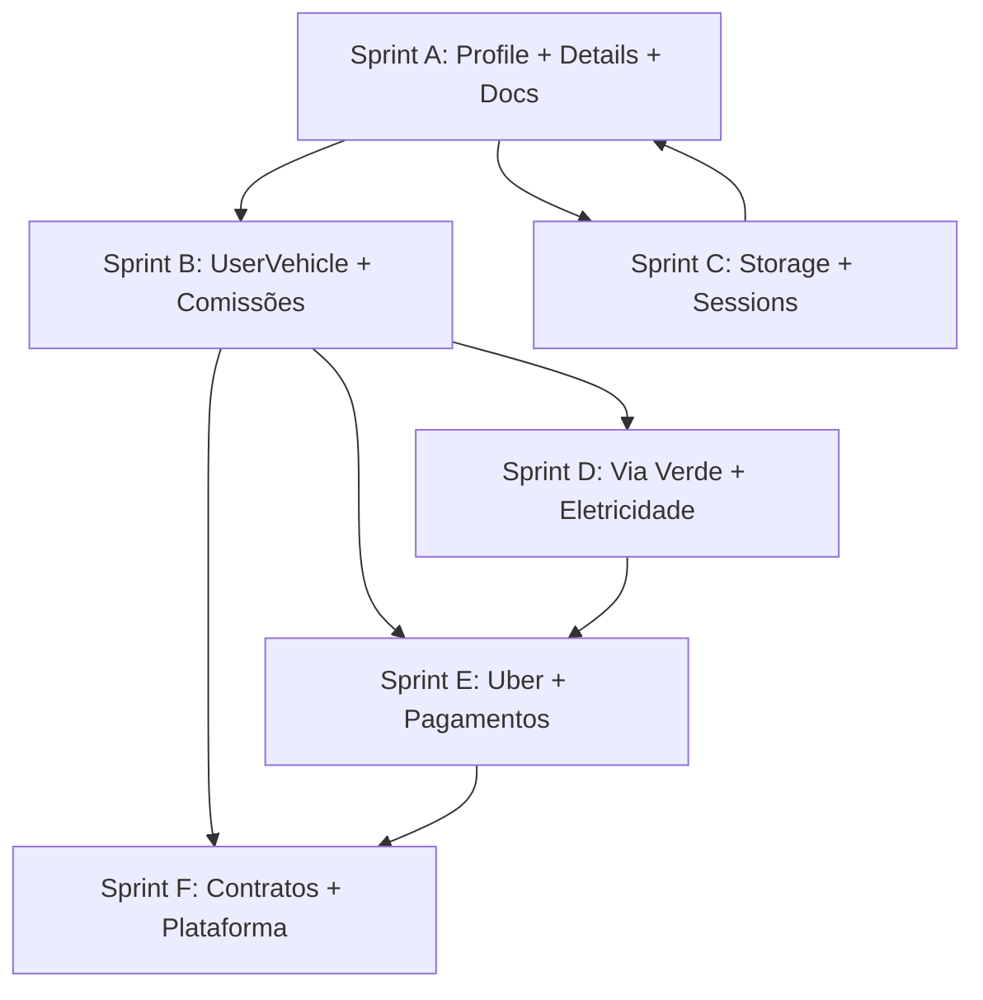

# Roadmap TVDE — Plataforma de Gestão de Frota

Documento de referência para migrar e evoluir funcionalidades do projeto PHP legado para o monorepo TVDE (Next.js + Fastify + PostgreSQL + Prisma).

**Última actualização:** 19 Julho 2026  
**Estado actual:** Bolt + utilizadores; Via Verde / Eletricidade / Combustível / Uber com import + Portal RPA; **Pagamentos** (calculadora + massa + mark/unmark pagos) — ver [`08-PAGAMENTOS.md`](./08-PAGAMENTOS.md).

---

## 1. Visão geral

O TVDE é uma plataforma multi-tenant para gestores de frota TVDE (Portugal), com integrações Uber, Bolt, Via Verde, PRIO (eletricidade/combustível), pagamentos a motoristas, contratos, documentos e contabilidade operacional.

### Stack actual

| Camada | Tecnologia |
|--------|------------|
| Web | Next.js 14 (App Router), port 3003 |
| API | Fastify, port 3002 |
| BD | PostgreSQL + Prisma |
| Partilhado | `@tvde/shared`, `@tvde/database` |

### Roles (cadeia de delegação)

```
MASTER       → dono da plataforma; vê tudo
superadmin   → Gestor de Frota; gere frota, motoristas e staff
admin        → Motorista
staff        → Staff operacional
```

### Multitenancy

- **Tenant** (`siteId`) — cliente / frota
- **Workspace** — sub-divisão dentro do tenant
- **Módulos** — activação por tenant/workspace (`TenantModule`, `WorkspaceModule`)

---

## 2. O que já está feito

### 2.1 Infraestrutura core

- [x] Auth JWT + sessões + refresh
- [x] Multitenancy (tenant + workspace)
- [x] Roles e permissões (`packages/shared/src/permissions.ts`)
- [x] Audit log
- [x] SMTP platform/tenant + templates email
- [x] Branding tenant (logo, wallpaper login)
- [x] Módulos registáveis + activação por workspace

### 2.2 Utilizadores

- [x] Listagem em cartões (estilo projeto antigo)
- [x] Criar utilizador (modal) — username, email, telefone, role, status, morada futura
- [x] Password opcional → geração automática + email (`user_welcome`)
- [x] Editar utilizador (modal)
- [x] Eliminar com confirmação OTP por email
- [x] Toggle active/suspended (superadmin + MASTER)
- [x] Motorista (`admin`) **não cria** utilizadores
- [x] Campos BD: `username`, `fullName`, `phone`

### 2.3 Bolt (referência para outros módulos)

- [x] Migration + models (`bolt_connections`, `bolt_orders`, `bolt_drivers`, `bolt_vehicles`, …)
- [x] Pacote `@tvde/bolt` (OAuth, client API)
- [x] Sync worker 24h + filtros pedidos (`finished`, `ride_price > 0`)
- [x] Web: dashboard, pedidos, motoristas, veículos
- [x] Config: Settings → Bolt API
- [x] Documentação: `docs/bolt_api.md`

### 2.4 Navegação e settings (shell)

- [x] Nav: Uber, Via Verde, Eletricidade, Combustível, **Pagamentos** (módulo activo)
- [x] Settings → TVDE submenu: Sessions, Storage, Limite viaturas; Contratos / Métodos / Conta corrente (placeholders)
- [x] 2FA self-service: `/dashboard/settings/two-fa`

### 2.4b Pagamentos (Sprint E — parcial)

- [x] Calculadora manual + confirmar → `payment_reports`
- [x] Pagamentos em massa + sync plataformas (Uber→Bolt→VV→Prio)
- [x] Mark/unmark fidedigno VV / elec / fuel / Uber / Bolt (`is_paid`)
- [x] Listagem + detalhe tipo calculadora
- [ ] Conta corrente, email/WhatsApp, anexos ZIP
- Doc: [`08-PAGAMENTOS.md`](./08-PAGAMENTOS.md)

### 2.5 O que falta na UI de utilizadores (stubs)

| Botão / área | Estado |
|--------------|--------|
| **Details** | Visual apenas |
| **Viatura** (carro) | Visual apenas |
| **Acessos** (chave) | Visual apenas |
| **Calculadora** | Removido da UI (fase posterior) |
| **Meu Perfil** | Não existe rota dedicada |

---

## 3. Arquitectura: legado PHP → TVDE novo

| Conceito antigo | TVDE actual | Adaptação |
|-----------------|-------------|-----------|
| `site_id` | `Tenant.siteId` + `User.tenantId` | Herança automática na criação ✓ |
| `users` + morada/NIF/CC | `User` básico | Estender com `UserProfile` |
| `user_vehicles` | — | **Nova entidade central** |
| `user_documents` | — | Upload + model `UserDocument` |
| `viaverdemov` | Placeholder | Importador + API |
| `priomov` (eletricidade) | Placeholder | Importador PRIO |
| `payment_reports` | `PaymentReport` + mark paid nas fontes | [`08-PAGAMENTOS.md`](./08-PAGAMENTOS.md) |
| `site_storage_limits` | `Tenant.limitsJson` | Formalizar quotas |
| Módulos por site | `TenantModule` | Já existe |
| Impersonate | — | MASTER only + audit |

---

## 4. Modelo de dados proposto

### 4.1 Núcleo utilizador

```
User (existente)
├── username, email, fullName, phone, role, status
├── UserProfile (novo)
│   ├── nif
│   ├── ccAutorizacaoResidencia
│   ├── numeroOperadorTvde      # Certificado CMTVDE
│   ├── distrito, concelho, localidade
│   ├── arruamento, numeroPorta, codigoPostal
│   └── (fase contratos) naturalidade, docEmissao, cartaConducao, …
├── UserDocument[] (novo)
│   ├── documentType, visibility (private|public)
│   ├── filePath, fileName, mimeType, sizeBytes
│   └── uploadedBy, createdAt
└── UserVehicle[] (novo) — ver abaixo
```

### 4.2 Matrículas e comissões (hub central)

```
UserVehicle
├── userId, tenantId
├── matricula
├── dataInicio, dataFim          # null fim = activo
├── uuidUber, uuidBolt
├── numCartaoPrio                # PRIO eletricidade/combustível
├── nomeCompleto                 # fallback matching PRIO
├── marca, modelo, ano
├── aluguelViatura               # nullable; NULL ≠ 0
└── VehicleCommission (embedded ou 1:1)
    ├── tipo: fixa | percentagem | slot
    ├── valor
    ├── iva6: boolean
    ├── slotIncluirViaVerde
    └── slotIncluirEletricidadeCombustivel
```

**Regra crítica (relatórios):** por matrícula/UUID, no intervalo `[dataInicio, dataFim]` do relatório, seleccionar **um** registo `UserVehicle` — o de **maior sobreposição** de dias; empate → preferir registo com `dataFim` definida.

Ref: `docs/ficheiros de exemplo/PAYMENT_CALCULATOR.md`, `AREA_USERS_VEHICLES.md`, `VEHICLE_COMMISSION_SYSTEM.md`

### 4.3 Frota master (fase 2 — módulo Viaturas)

```
FleetVehicle (opcional, fase posterior)
├── matricula, marca, modelo, ano, cor
├── documentos viatura (DUA, seguro, inspeção TVDE, comodato, …)
└── histórico motoristas
```

Ref: `docs/ficheiros de exemplo/viaturas.md`

### 4.4 Despesas e pagamentos

```
ViaVerdeMovement     — import por tenant, matrícula, is_payed
ElectricityCharge    — PRIO, num_cartao, is_payed
FuelTransaction      — PRIO combustível
DriverExpense        — conta corrente (ajustes manuais)
PaymentReport        — período, totais, ids marcados pagos, HTML email
```

### 4.5 Contratos

```
CompanyData          — dados empresa contratante por tenant
ContractTemplate     — placeholders
UserContract         — contrato gerado por motorista
```

Ref: `docs/ficheiros de exemplo/CONTRATOS_MOTORISTAS_ANALISE.md`

### 4.6 Storage

```
TenantStorageUsage   — cache bytes usados
Tenant.limitsJson    — max_storage_gb, max_vehicles, max_users, …
```

Ref: `docs/ficheiros de exemplo/STORAGE_MANAGEMENT.md`, `VEHICLE_LIMITS_MANAGEMENT.md`

---

## 5. UI — mapa ecrãs (projeto antigo → TVDE)

### 5.1 Cartão utilizador (lista)

| Acção | Implementação alvo |
|-------|-------------------|
| Badge Active/Inactive | ✓ Feito |
| **Details** | Modal multi-secção (info básica, morada, documentos) |
| **Editar** | ✓ Modal básico — evoluir ou fundir com Details |
| **Viatura** | Modal «Gerir Matrículas» |
| **Acessos** | Permissões granulares por módulo |
| **Eliminar** | ✓ OTP email |
| **Toggle** | ✓ superadmin only |
| **Calculadora** | Modal gerar pagamento (Sprint E) |

### 5.2 Modal Details (utilizador)

**Secção — Informações básicas**
- Email, role, status, criado em (read-only)
- Nome completo, telefone WhatsApp
- NIF, CC/autorização residência, Certificado CMTVDE

**Secção — Morada**
- Distrito, concelho, localidade, arruamento, nº porta, código postal

**Secção — Documentos**
- Upload: visibilidade (privado/público), tipo documento, ficheiro (max 5MB)
- Tipos motorista: CC, Licença TVDE, Carta condução, Contrato motorista, Comprovativo morada
- Tipos viatura (fase frota): Carta verde, DUA, Inspeção TVDE, Comodato, …
- Cards: ver, eliminar

Ref: imagens + `USER_DOCUMENTS_UPLOAD.md`, `USER_UPDATE_EDITandDETAILS.md`

### 5.3 Modal Gerir Matrículas (ícone carro)

- Lista matrículas activas/histórico
- Form: matrícula*, data início*, data fim, UUID Uber, UUID Bolt, cartão PRIO, marca/modelo/ano
- Comissão: fixa | percentagem | slot (+ flags IVA, VV, eletricidade)
- Editar data fim inline (popover)
- Eliminar registo

### 5.4 Meu Perfil (`/dashboard/me`)

- Foto perfil (upload)
- Nome, email, role, Site ID, UUID, 2FA status
- Último login, data criação
- Session token (read-only) + revogar sessões
- Atalhos: Configurar 2FA, Alterar password
- (superadmin) Testar template emails

Ref: imagens perfil + `/auth/sessions`, `/dashboard/settings/two-fa`

---

## 6. Módulos operacionais

Padrão de implementação: **copiar Bolt** (package → API routes → sync → web dashboard → settings).

| Módulo | Nav | Settings | Docs legado | Dependências |
|--------|-----|----------|-------------|--------------|
| **Bolt** | ✓ | ✓ | `AREA_BOLT.md`, `bolt_api.md` | — |
| **Uber** | shell | — | `UBER_MODULE.md`, `AREA_UBER.md` | `user_vehicles.uuidUber` |
| **Via Verde** | shell | — | `VIAVERDE.md`, `AREA_VIA_VERDE.md` | `user_vehicles.matricula` |
| **Eletricidade** | shell | — | `AREA_ELETRICIDADE.md` | PRIO + `numCartaoPrio` |
| **Combustível** | shell | — | (PRIO partilhado) | `numCartaoPrio` |
| **Pagamentos** | calc + gravar | [`08-PAGAMENTOS.md`](./08-PAGAMENTOS.md) | `PAYMENT_CALCULATOR.md`, `RELATORIOS_MOTORISTAS.md` | Todos acima |
| **Viaturas** | (futuro) | — | `viaturas.md` | FleetVehicle |

### 6.1 Via Verde — resumo funcional

- Import CSV/XLSX → `ViaVerdeMovement`
- Filtros: matrícula, datas, pago/não pago
- Marcar pago / eliminar (superadmin)
- Integração pagamentos: movimentos incluídos no `PaymentCalculator`

### 6.1 Eletricidade — resumo funcional

- Import PRIO → `ElectricityCharge`
- Normalização datas/valores PT, deduplicação
- Dashboard carregamentos + flag `is_payed`
- Matching por `num_cartao` ou `nome_completo` via `UserVehicle`

### 6.3 Pagamentos — resumo funcional

```
Receitas  = Uber + Bolt (por UUID, sem duplicar)
Despesas  = Via Verde + Eletricidade + Combustível + Comissões + Conta corrente
Resultado = Receitas − Despesas
```

- Modal calculadora: seleccionar motorista + período (semana Seg–Dom, sem datas futuras)
- Gerar HTML + email + gravar `PaymentReport`
- Marcar movimentos como pagos

Ref: `PAYMENT_CALCULATOR.md`, `AREA_PAGAMENTOS_EMAIL.md`

---

## 7. Configurações TVDE (submenu)

| Rota | Funcionalidade | Doc |
|------|----------------|-----|
| `/dashboard/settings/tvde/sessions` | Sessões activas tenant + revogar | `ACCOUNT_ACTIVITY.md` |
| `/dashboard/settings/tvde/storage` | Quota vs uso, planos | `STORAGE_MANAGEMENT.md` |
| `/dashboard/settings/tvde/limite-viaturas` | `max_vehicles` enforcement | `VEHICLE_LIMITS_MANAGEMENT.md` |
| `/dashboard/settings/tvde/contratos` | Templates + dados empresa | `CONTRATOS_MOTORISTAS_ANALISE.md` |
| `/dashboard/settings/tvde/metodos-pagamento` | Config envio relatórios | `AREA_PAGAMENTOS_EMAIL.md` |
| `/dashboard/settings/tvde/conta-corrente` | Tipos ajuste `DriverExpense` | `PAYMENT_CALCULATOR.md` |

---

## 8. Funcionalidades plataforma (fase posterior)

| Feature | Doc | Notas |
|---------|-----|-------|
| Impersonate | `IMPERSONATE.md` | MASTER only, banner, audit |
| Import users CSV | `IMPLEMENTAÇÃO_IMPORT_USERS.md` | Bulk create |
| Transferência users | `USER_TRANSFER_SYSTEM.md` | Entre tenants |
| Logo emails | `EMAIL_LOGO_IMPLEMENTATION.md` | Tenant branding |
| Manutenção | `MAINTENANCE_MODE_SYSTEM.md` | Flag global |
| Notificações admin | `ADMIN_NOTIFICATIONS_SYSTEM.md` | In-app + email |
| OCR documentos | `ocr.md` | Opcional |
| WhatsApp | `AREA_WHATSAPP.md` | Já parcial na plataforma |
| Permissões granulares | `USER_SUPERADMIN_GRANULAR_PERMISSIONS.md` | Ícone chave |
| Reset password manual | `RESET_PASS.md` | Admin gera nova password |

---

## 9. O que reutilizar (não reinventar)

| Área | Ficheiros / serviços existentes |
|------|--------------------------------|
| Auth + sessões | `auth.service.ts`, `auth.routes.ts` |
| 2FA | `twofa.service.ts`, `settings-two-fa-panel.tsx` |
| Delete OTP | `action-confirmation.service.ts` |
| Welcome email | `user-welcome-email-template.ts` |
| Permissões | `permissions.ts`, `canManageUser`, `canCreateUsers`, … |
| Validação user | `user-validation.ts` |
| Módulos | seed + `ModuleAccessGuard` + workspace toggle |
| Bolt pattern | `packages/bolt/`, `bolt.routes.ts`, `bolt-sync.service.ts` |
| Branding | `tenant-branding` |
| Audit | `audit.service.ts` |
| Phone WhatsApp | `whatsapp-phone.ts` |
| Morada PT | Distritos/concelhos (a importar ou API) |

---

## 10. Sprints — ordem de implementação

### Sprint A — Perfil & detalhes utilizador ⬅ **PRÓXIMO**

**Objectivo:** Modal Details, perfil próprio, base documentos.

| # | Tarefa | Entregável |
|---|--------|------------|
| A1 | Migration `UserProfile` (+ campos morada, NIF, CC, CMTVDE) | Prisma + seed |
| A2 | API `GET/PATCH /users/:id/profile` | `business.routes.ts` ou `users.routes.ts` |
| A3 | Modal **Details** (info + morada + guardar) | `user-details-modal.tsx` |
| A4 | Página **`/dashboard/me`** (Meu Perfil) | foto, metadata, 2FA link, sessões |
| A5 | API + UI **documentos** upload básico | `UserDocument`, max 5MB |
| A6 | Storage check antes upload | hook em upload service |
| A7 | Separar **Edit** (básico) vs **Details** (extendido) | dois endpoints como PHP legado |

**Docs:** `USER_UPDATE_EDITandDETAILS.md`, `USER_DOCUMENTS_UPLOAD.md`

---

### Sprint B — Matrículas & comissões

**Objectivo:** Ícone carro funcional; base para todos os módulos.

| # | Tarefa | Entregável |
|---|--------|------------|
| B1 | Migration `UserVehicle` + commission fields | Prisma |
| B2 | CRUD API `/users/:id/vehicles` | list, create, update, delete |
| B3 | Modal **Gerir Matrículas** | UI completa |
| B4 | Regra sobreposição datas (helper shared) | `user-vehicle-overlap.ts` |
| B5 | Settings → **Limite viaturas** | enforcement na criação |
| B6 | Normalização matrícula PT | `formatLicensePlate` ou novo helper |

**Docs:** `AREA_USERS_VEHICLES.md`, `VEHICLE_COMMISSION_SYSTEM.md`

---

### Sprint C — Storage & sessions (Settings TVDE)

| # | Tarefa | Entregável |
|---|--------|------------|
| C1 | Cálculo uso storage por tenant | service |
| C2 | UI Settings → Storage | quota, uso, alertas |
| C3 | UI Settings → Sessions | lista + revogar |
| C4 | Enforcement quota em todos uploads | middleware |

**Docs:** `STORAGE_MANAGEMENT.md`, `ACCOUNT_ACTIVITY.md`

---

### Sprint D — Via Verde + Eletricidade (paralelo)

| # | Tarefa | Módulo |
|---|--------|--------|
| D1 | Models + migration | ambos |
| D2 | Importador Via Verde (CSV) | Via Verde |
| D3 | Importador PRIO eletricidade | Eletricidade |
| D4 | Web listagens + filtros + paginação | ambos |
| D5 | Marcar pago / eliminar | ambos |
| D6 | Dashboard cards (totais pendentes) | ambos |
| D7 | Ligação `user_vehicles` para matching | ambos |

**Docs:** [`04-VIAVERDE.md`](./04-VIAVERDE.md), [`05-PRIO.md`](./05-PRIO.md), [`06-UBER.md`](./06-UBER.md), [`08-PAGAMENTOS.md`](./08-PAGAMENTOS.md), **[`03-PORTAL_RPA.md`](./03-PORTAL_RPA.md)** (ligar conta + keep-alive)

---

### Sprint D+ — Portal RPA Sync

| # | Tarefa | Estado |
|---|--------|--------|
| R0 | Schema `PortalConnection` + API + UI Ligar conta | feito |
| R1 | Via Verde Playwright + sync parsers | feito |
| R2 | MyPRIO + OTP modal + eletricidade/combustível | feito |
| R3 | Uber + OTP + `parseUberCsv` | feito |

**Doc operativa:** [`docs/03-PORTAL_RPA.md`](./03-PORTAL_RPA.md) — Chromium (`npm run playwright:install`), env `PORTAL_RPA_*`, keep-alive de sessões (refresh 3h + re-login Via Verde/Uber), troubleshooting.
| # | Tarefa | Entregável |
|---|--------|------------|
| E1 | `@tvde/uber` package + OAuth/API | como Bolt |
| E2 | Sync orders/drivers | worker |
| E3 | Web dashboard Uber | nav module |
| E4 | Import combustível PRIO | módulo Combustível |
| E5 | `PaymentCalculator` service | packages ou api |
| E6 | Modal calculadora (ícone) + email relatório | UI + `PaymentReport` |
| E7 | Marcar movimentos pagos em bulk | pós-geração |

**Docs:** `UBER_MODULE.md`, `PAYMENT_CALCULATOR.md`, `RELATORIOS_MOTORISTAS.md`

---

### Sprint F — Contratos, conta corrente, plataforma

| # | Tarefa | Entregável |
|---|--------|------------|
| F1 | Settings → Contratos (templates + company data) | UI + PDF |
| F2 | Settings → Conta corrente | `DriverExpense` CRUD |
| F3 | Settings → Métodos pagamento | config email |
| F4 | Impersonate MASTER | API + banner |
| F5 | Import users CSV | bulk |
| F6 | Permissões granulares (ícone chave) | UI + BD |
| F7 | Módulo Viaturas (frota master) | nav + CRUD |

**Docs:** `CONTRATOS_MOTORISTAS_ANALISE.md`, `IMPERSONATE.md`, `viaturas.md`

---

## 11. Referência — documentação legado

Todos em `docs/ficheiros de exemplo/`:

| Ficheiro | Tema |
|----------|------|
| `USER_UPDATE_EDITandDETAILS.md` | Edit vs Details forms |
| `USER_DOCUMENTS_UPLOAD.md` | Upload documentos |
| `AREA_USERS_VEHICLES.md` | Matrículas + aluguel |
| `VEHICLE_COMMISSION_SYSTEM.md` | Comissões fixa/%/slot |
| `VEHICLE_COMMISSION_SYSTEM_PROPOSAL.md` | Proposta extendida |
| `PAYMENT_CALCULATOR.md` | Cálculo pagamentos |
| `RELATORIOS_MOTORISTAS.md` | Relatórios email |
| `VIAVERDE.md` | Via Verde completo |
| `AREA_VIA_VERDE.md` | Via Verde resumo |
| `AREA_ELETRICIDADE.md` | PRIO eletricidade |
| `UBER_MODULE.md` | Uber import/sync |
| `AREA_UBER.md` | Uber área |
| `viaturas.md` | Módulo frota |
| `STORAGE_MANAGEMENT.md` | Quotas storage |
| `VEHICLE_LIMITS_MANAGEMENT.md` | Limite viaturas |
| `CONTRATOS_MOTORISTAS_ANALISE.md` | Contratos PDF |
| `IMPERSONATE.md` | Personificação MASTER |
| `IMPLEMENTAÇÃO_IMPORT_USERS.md` | Import CSV |
| `USER_TRANSFER_SYSTEM.md` | Transferência tenant |
| `EMAIL_LOGO_IMPLEMENTATION.md` | Logo emails |
| `MAINTENANCE_MODE_SYSTEM.md` | Modo manutenção |
| `ADMIN_NOTIFICATIONS_SYSTEM.md` | Notificações |
| `USER_SUPERADMIN_GRANULAR_PERMISSIONS.md` | Permissões módulo |
| `USER_DELETION_2FA.md` | Delete com OTP ✓ migrado |

---

## 12. Convenções de implementação

### API

- Rotas em `apps/api/src/routes/`
- Serviços de domínio em `apps/api/src/services/`
- Validação Zod + regras partilhadas em `@tvde/shared`
- Audit log em acções sensíveis
- OTP email para delete/destructive (padrão `action-confirmation.service.ts`)

### Web

- Páginas em `apps/web/src/app/dashboard/`
- Componentes módulo em `apps/web/src/components/{modulo}/`
- Modais: `@/components/modal`
- Guards: `ModuleAccessGuard`, `SettingsAccessGuard`
- Rotas: `WEB_ROUTES` + `API_PATHS` em `@tvde/shared`

### Módulos novos

1. Prisma schema + migration
2. Registar em `seed.ts` (`BUSINESS_MODULES`)
3. `DASHBOARD_ACCESS` + labels em `module-access.ts`
4. Package client (se API externa)
5. API routes + sync worker (se aplicável)
6. Web layout + subnav + pages
7. Settings panel (se credenciais)
8. Documentação em `docs/`

---

## 13. Dependências entre sprints



**Bloqueante universal:** Sprint B (`UserVehicle`) desbloqueia Uber, Via Verde, Eletricidade, Combustível e Pagamentos.

---

## 14. Critérios de done (por feature)

- [ ] Migration Prisma aplicada
- [ ] API com testes manuais / tipos correctos
- [ ] UI funcional com guards de role/módulo
- [ ] Multitenancy respeitado (tenantId em queries)
- [ ] Audit log em mutações sensíveis
- [ ] Documentação actualizada em `docs/`
- [ ] Build web + API sem erros
- [ ] Módulo activável em Settings → Workspaces (se aplicável)

---

## 15. Próximo passo imediato

**Iniciar Sprint A:**

1. Migration `UserProfile`
2. API profile
3. Modal **Details** ligado ao botão cyan
4. Página **Meu Perfil** (`/dashboard/me`)
5. Upload documentos (MVP)

Após Sprint A → Sprint B (matrículas) sem pausa, pois é o hub de toda a operação TVDE.
