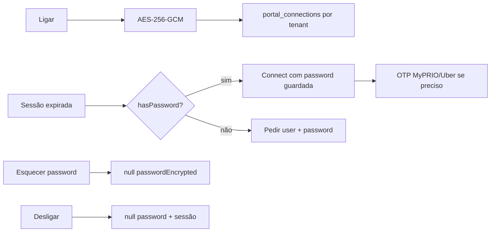

# 09 — Encriptação e credenciais

Documento de referência da **encriptação at-rest** no TVDE e do fluxo de **credenciais de portal** (reutilizar / esquecer).  
Complementa [`03-PORTAL_RPA.md`](./03-PORTAL_RPA.md) e [`08-PAGAMENTOS.md`](./08-PAGAMENTOS.md).

**Última actualização:** 22 Julho 2026

---

## 1. Resumo

| Tema | Decisão |
|------|----------|
| Algoritmo | **AES-256-GCM** |
| Chave | `ENCRYPTION_KEY` (env) → SHA-256 → chave de 32 bytes |
| Formato BD | `ivHex:tagHex:ciphertextHex` |
| Multi-tenant | Isolamento por linha (`tenantId`); **não** há chave por tenant / KMS |
| Password na API pública | **Nunca** — só `hasPassword` + `usernameMasked` |
| Guardar password no Ligar | **Sempre** (sem checkbox «lembrar») |
| Esquecer | Limpa só `passwordEncrypted` |
| Desligar | Limpa `passwordEncrypted` **e** `sessionStateEncrypted` |



---

## 2. Primitivas crypto

**Ficheiro:** [`apps/api/src/lib/crypto.ts`](../apps/api/src/lib/crypto.ts)

| Função | Uso |
|--------|-----|
| `encrypt(text)` | Segredos at-rest (AES-256-GCM, IV 12 bytes aleatório) |
| `decrypt(payload)` | Lê `iv:tag:data` (hex) |
| `hashToken(token)` | SHA-256 hex (tokens de auth / confirmação — **não** é AES) |
| `generateToken(bytes?)` | Bytes aleatórios em hex |

```ts
// Chave efectiva = SHA-256(ENCRYPTION_KEY)
// Ciphertext = `${iv.toString('hex')}:${tag.toString('hex')}:${encrypted.toString('hex')}`
```

**Env:** `ENCRYPTION_KEY` (ver [`.env.example`](../.env.example)).  
Em produção: string longa e aleatória; **não** rodar a chave sem plano de re-encriptação (os blobs existentes deixam de desencriptar).

Config partilhada: `encryptionKey` em `@tvde/shared` / `packages/shared/src/config.server.ts`.

---

## 3. O que é encriptado (por domínio)

Tudo usa o **mesmo** `encrypt` / `decrypt` e a **mesma** `ENCRYPTION_KEY`.

| Domínio | Campos típicos | Serviço |
|---------|----------------|---------|
| **Portal RPA** (Via Verde / MyPRIO / Uber) | `usernameEncrypted`, `passwordEncrypted`, `sessionStateEncrypted` | `portal-connection.service.ts` |
| Bolt API | `encryptedClientSecret` | `bolt-connection.service.ts` |
| Moloni | `encryptedClientSecret`, access/refresh tokens | `moloni-connection.service.ts` |
| Billing / Stripe-like | client secret, tokens | `billing.service.ts` |
| Email SMTP | `encryptedPassword` | `email.service.ts` |
| SMS | `encryptedAuthToken` | `sms.service.ts` |
| 2FA TOTP | secret encriptado no user | `twofa.service.ts` |

Outros campos `encrypted*` no Prisma seguem o mesmo padrão.

**Não** confundir com passwords de login TVDE (utilizadores da app): essas usam hashing de password de auth, não este AES de integração.

---

## 4. Portal RPA — credenciais por tenant

### Modelo

Tabela `portal_connections` (`PortalConnection`):

| Campo | Conteúdo |
|-------|----------|
| `tenantId` + `portal` | Único (`via_verde` \| `myprio` \| `uber`) |
| `usernameEncrypted` | User / email / telefone |
| `passwordEncrypted` | Password do portal |
| `sessionStateEncrypted` | Playwright `storageState` (cookies) |
| `status` | `disconnected` / `connected` / `awaiting_otp` / `expired` / `error` |

Isolamento multi-tenant = **uma linha por (tenant, portal)**. Um leak da BD sem a `ENCRYPTION_KEY` não revela passwords em claro; com a chave + dump, **todos** os tenants ficam expostos (sem DEK por tenant).

### API pública (`PortalConnectionPublic`)

| Campo | Significado |
|-------|-------------|
| `usernameMasked` | Username parcial (ex. `61***71`) |
| `hasPassword` | Existe `passwordEncrypted` |
| `hasSession` | Existe `sessionStateEncrypted` |
| `useStoredCredentials` (input connect) | Pedir reutilização no servidor |

A password **nunca** é devolvida ao browser.

### Ligar / reutilizar

1. **Ligar** com user+password → grava ambos encriptados e inicia job Playwright.
2. Se `hasPassword` e `useStoredCredentials` (ou body sem password com password já guardada) → o servidor faz `decrypt` e reutiliza; o UI mostra «Continuar» sem campos.
3. Password nova no formulário → re-encripta e actualiza.
4. MyPRIO / Uber: mesmo com password guardada, o portal pode exigir **OTP SMS** (não contornável).
5. Via Verde: pode fazer re-login silencioso com password guardada (sem OTP).

### Esquecer vs Desligar

| Acção | Endpoint | O que limpa |
|-------|----------|-------------|
| **Esquecer password** | `POST /portal-connections/:portal/forget-password` | Só `passwordEncrypted` (mantém username + sessão) |
| **Desligar** | `DELETE /portal-connections/:portal` | `passwordEncrypted` + `sessionStateEncrypted` (+ status disconnected) |
| **Limpar** mensagens | `POST …/clear-messages` | `lastError` / job falhado — **não** toca em credenciais |

### Rotas relevantes

| Método | Path |
|--------|------|
| GET | `/portal-connections` / `/:portal` |
| POST | `/:portal/connect` — `{ username?, password?, useStoredCredentials? }` |
| POST | `/:portal/forget-password` |
| DELETE | `/:portal` — Desligar |

Paths em `@tvde/shared`: `API_PATHS.portalConnections.*` (`forgetPassword`, `connect`, `disconnect`, …).

### UI

| Componente | Comportamento |
|------------|---------------|
| [`portal-connection-panel.tsx`](../apps/web/src/components/portal/portal-connection-panel.tsx) | Conta portal: Continuar / Introduzir outra / Esquecer / Desligar; badge «password guardada» |
| [`portal-quick-login-modal.tsx`](../apps/web/src/components/pagamentos/portal-quick-login-modal.tsx) | Login no sync de Pagamentos: mesmo fluxo + OTP se `awaiting_otp` |

Confirmações destrutivas usam `ConfirmDialog` (não `window.confirm`).

---

## 5. Segurança — o que isto garante e o que não

**Garante**

- Segredos em claro só em memória no processo da API (decrypt no servidor).
- Ciphertext autenticado (GCM tag) — adulteração detectável.
- IV aleatório por encrypt → mesmo plaintext ≠ mesmo blob.
- UI / API não expõem a password.
- Gestor pode **esquecer** a password sem desligar a sessão (enquanto cookies forem válidos).

**Não garante (fora de âmbito actual)**

- Chave por tenant / envelope encryption / KMS (AWS, Vault, etc.).
- Contornar OTP SMS MyPRIO/Uber.
- Protecção se `ENCRYPTION_KEY` e dump da BD forem roubados juntos.
- Rotação automática de chave.

Endurecimento futuro possível (sem mudar o modelo de dados): derivar chave de portal com `HMAC(ENCRYPTION_KEY, tenantId)` e dual-read (legado global → re-encrypt).

---

## 6. Operação

1. Definir `ENCRYPTION_KEY` forte em `.env` / secrets de produção **antes** de ligar portais.
2. Backup da chave com o mesmo rigor que a BD — sem ela, credenciais e tokens ficam ilegíveis.
3. Após «Esquecer password», o próximo Ligar (excepto reutilização) pede password outra vez.
4. Após «Desligar», próximo Ligar é login completo (+ OTP se o portal exigir).
5. Não commitar `.env` nem dumps com ciphertext + chave.

---

## 7. Ficheiros-chave

| Path | Papel |
|------|-------|
| `apps/api/src/lib/crypto.ts` | AES-GCM + hash/token |
| `apps/api/src/services/portal-rpa/portal-connection.service.ts` | encrypt/decrypt portal; `forgetPortalPassword`; `startPortalConnect` |
| `apps/api/src/routes/portal-connection.routes.ts` | Rotas connect / forget-password / disconnect |
| `packages/shared/src/portal-rpa.ts` | `PortalConnectionPublic.hasPassword`, `PortalConnectInput` |
| `packages/shared/src/routes.ts` | `forgetPassword` path |
| `packages/database/prisma/schema.prisma` | `PortalConnection` |

---

*Documento criado 2026-07-22 — AES-256-GCM, credenciais de portal, reutilizar e esquecer.*
