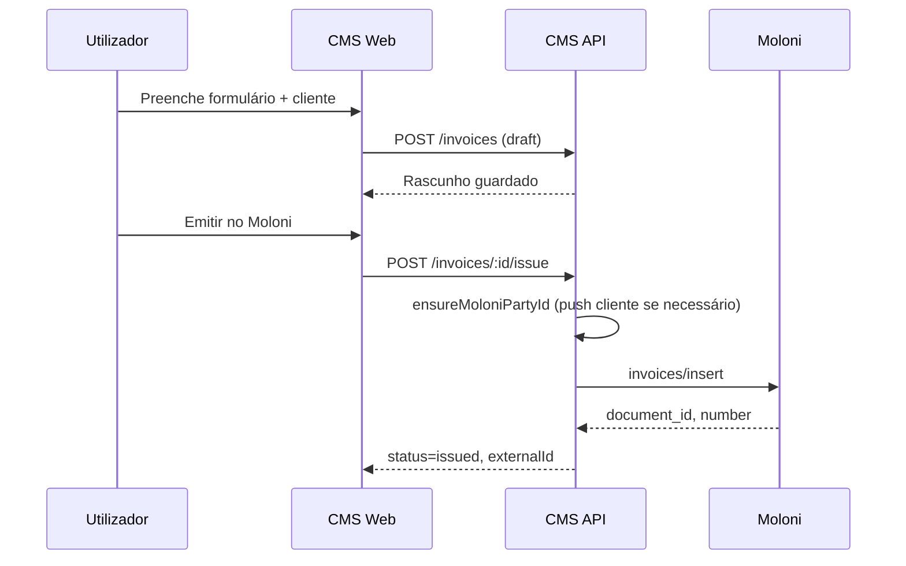
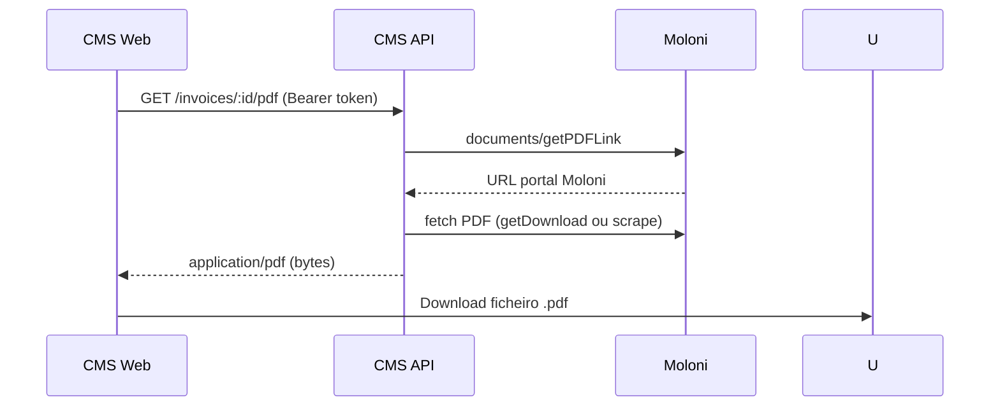
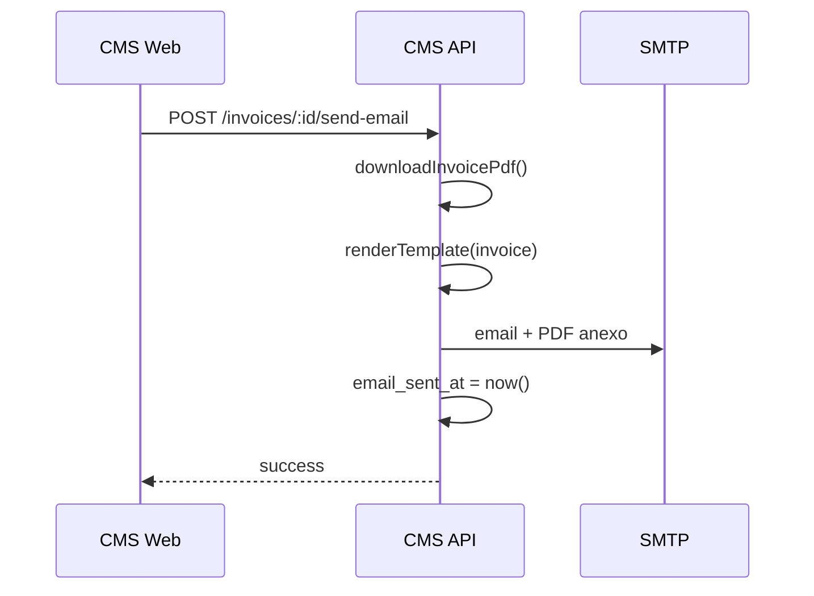
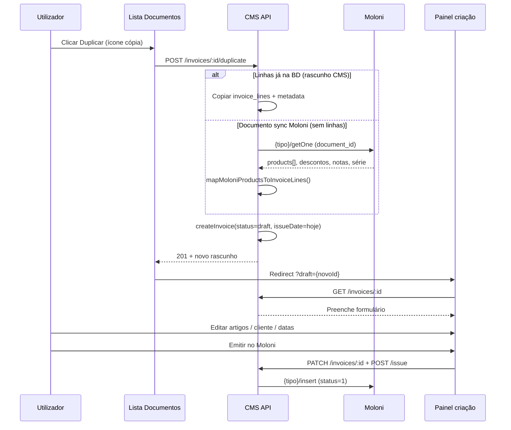

# Módulo de Facturação — Guia completo

Documentação de referência do módulo **Facturação** do CMS multi-tenant, integrado com [Moloni](https://www.moloni.pt) (Portugal).

**Índice da documentação:**

| Documento | Conteúdo |
|-----------|----------|
| [FATURACAO.md](./FATURACAO.md) | Este guia (visão geral, UI, fluxos, BD, troubleshooting) |
| [ENTITIES.md](./ENTITIES.md) | Entidades fiscais, CRM ↔ Moloni, conflitos, cron |
| [MOLONI.md](./MOLONI.md) | API Moloni, OAuth, endpoints, PDF |
| [CMS-API.md](./CMS-API.md) | Referência REST `/api/v1/invoices`, `/billing/*` |
| [EMAIL.md](./EMAIL.md) | Templates de email, SMTP, envio de faturas |
| [README.md](./README.md) | Pacote `@tvde/billing` portável |

---

## 1. Visão geral

### O que faz o módulo

- **Criar rascunhos** de documentos fiscais (faturas, FS, FR, notas de débito) no CMS
- **Emitir no Moloni** com comunicação à AT (fatura sem papel)
- **Gerir entidades fiscais** (clientes e fornecedores Moloni), independentes do CRM
- **Sincronizar** dados Moloni → CMS (entidades, catálogo, documentos históricos)
- **Descarregar PDF** directamente (sem abrir a página intermédia Moloni)
- **Enviar faturas por email** com PDF em anexo e template HTML personalizável
- **Duplicar documentos emitidos** como rascunho editável (espelho Moloni — cliente, artigos, descontos, notas)
- **Listagem unificada** em Documentos com data fiscal correcta (`issued_at`, não data de sync)

### O que *não* faz (limitações actuais)

- Não apaga documentos nem entidades no Moloni
- Não regista pagamentos (`paid`) nem cancelamentos via API
- Não sincroniza fornecedores como entidade de documentos de compra na importação
- A API Moloni pode expor **menos documentos** do que a interface web Moloni (histórico antigo)
- Apenas providers `local` (rascunho) e `moloni` (emitido)

### Stack

```
┌─────────────────────────────────────────────────────────────┐
│  apps/web          UI Next.js (dashboard/billing, settings) │
├─────────────────────────────────────────────────────────────┤
│  apps/api          Fastify — billing.routes.ts + services   │
├─────────────────────────────────────────────────────────────┤
│  packages/billing  Lógica Moloni portável (sem Prisma)      │
├─────────────────────────────────────────────────────────────┤
│  packages/database Prisma — invoices, billing_entities, …   │
└─────────────────────────────────────────────────────────────┘
```

---

## 2. Acesso e permissões

| Requisito | Detalhe |
|-----------|---------|
| Módulo activo | `billing` activo no tenant e no workspace |
| Role mínima | `staff` (ver `packages/shared/src/permissions.ts`) |
| Config Moloni | Apenas **superadmin** — `PUT /billing/moloni/config`, OAuth |
| OAuth callback | Sem JWT — validado por `state` assinado (15 min) |
| Cron sync | Header `X-Billing-Sync-Secret` — sem JWT |

### Rotas web

| Rota | Página |
|------|--------|
| `/dashboard/billing/entidades` | Clientes e fornecedores fiscais |
| `/dashboard/billing/documentos` | **Lista unificada** de todos os tipos (emitidos + rascunhos) |
| `/dashboard/billing/faturas` | Criar / editar **Faturas** |
| `/dashboard/billing/faturas-simplificadas` | Criar / editar Faturas simplificadas |
| `/dashboard/billing/faturas-recibo` | Criar / editar Faturas-recibo |
| `/dashboard/billing/notas-debito` | Criar / editar Notas de débito |
| `/dashboard/settings/moloni` | Ligação OAuth + sync + **email de faturas** (marca/SMTP) |
| `/dashboard/settings/smtp` | SMTP do sistema (não facturação Moloni) |
| `/dashboard/clients` | Hub CRM + links para facturação |

---

## 3. CRM vs entidades fiscais

Conceito central do módulo — ver [ENTITIES.md](./ENTITIES.md) para detalhe.

| Camada | Tabela | Propósito |
|--------|--------|-----------|
| **CRM** | `clients` | Contactos da aplicação (módulo Clientes) |
| **Fiscal** | `billing_entities` | Clientes/fornecedores para documentos Moloni |
| **Ponte** | `billing_entities.cms_client_id` | Ligação opcional 1:1 |

**Regra prática:** emitir faturas usa sempre `billing_entity_id`. O CRM é opcional.

```
CRM (clients)          billing_entities          Moloni
     │                        │                      │
     │── cms_client_id ──────►│◄── external_id ─────►│
```

---

## 4. Configuração inicial

### 4.1 Pré-requisitos

1. Conta Moloni com API activa (Developer ID + Secret)
2. `ENCRYPTION_KEY` no `.env` (32+ chars — encripta tokens Moloni)
3. Email de faturas configurado em **Configurações → Moloni** (marca + SMTP de facturação; fallback SMTP sistema)
4. Em desenvolvimento: **túnel HTTPS** (ngrok / cloudflared) — Moloni rejeita `localhost`
5. Em produção tvde.one: callback em `https://api.tvde.one/...` (não ngrok, não fleet)

### 4.2 Variáveis de ambiente (Moloni)

```env
# Prioridade: URI explícito > API_PUBLIC_URL + /billing/moloni/callback
# Produção:
NEXT_PUBLIC_MOLONI_REDIRECT_URI="https://api.tvde.one/api/v1/billing/moloni/callback"
NEXT_PUBLIC_API_PUBLIC_URL="https://api.tvde.one/api/v1"
# Dev (túnel):
# NEXT_PUBLIC_MOLONI_REDIRECT_URI="https://SEU_TUNEL.ngrok-free.app/api/v1/billing/moloni/callback"
# NEXT_PUBLIC_API_PUBLIC_URL="https://SEU_TUNEL.ngrok-free.app/api/v1"

# Sync cron (opcional)
BILLING_SYNC_SECRET="secret-forte"

# Email (fallback se não houver SMTP na UI)
SMTP_HOST=...
SMTP_PORT=587
SMTP_USER=...
SMTP_PASS=...
SMTP_FROM=...
NEXT_PUBLIC_APP_NAME="Nome da Empresa"
```

Ver [EMAIL.md](./EMAIL.md) e `docs/09-variaveis-ambiente.md`.

### 4.3 Ligar Moloni (passo a passo)

1. **Moloni Developer** → activar API → copiar Developer ID e Client Secret
2. **Moloni Developer** → Redirect URI = `{API_PUBLIC}/billing/moloni/callback`
3. CMS → **Configurações → Moloni** (superadmin)
4. Preencher Developer ID, Secret, empresa Moloni, série por defeito, Redirect URI
5. Clicar **Ligar conta Moloni** → autorizar no browser Moloni
6. Callback grava tokens encriptados em `billing_connections`
7. **Sincronizar** entidades + catálogo (painel Moloni ou API)

### 4.4 Verificar ligação

- Banner verde nas páginas de facturação (`billing-moloni-banner`)
- `GET /billing/moloni/status` → `healthy: true`
- `GET /billing/moloni/diagnostics` → contagens clientes/documentos

---

## 5. Interface utilizador

### 5.1 Entidades (`/dashboard/billing/entidades`)

**Separadores:** Clientes | Fornecedores

**Acções por entidade:**

| Acção | Descrição |
|-------|-----------|
| Novo cliente/fornecedor | Modal Geral + Contactos (NIF, morada, país, email, telefone) |
| Editar | Actualiza CMS; Moloni só após **Push** |
| Ligar CRM | Associa a um cliente do módulo Clientes |
| Confirmar ligação | Após match automático por NIF |
| Enviar ao Moloni | `customers/insert` ou `suppliers/insert` |
| Arquivar / Restaurar | Oculta ou reactiva no CMS (Moloni inalterado) |
| Eliminar | Só CMS; bloqueado se houver faturas emitidas ou rascunhos |

**Checkbox ao criar:** «Enviar ao Moloni após criar» (activo por defeito em Entidades).

**Consumidor final:** NIF `999999990` (checkbox no formulário).

### 5.2 Lista de documentos (`/dashboard/billing/documentos`)

Componente: `BillingDocumentsPanel` — vista consolidada de **todos** os tipos de documento do workspace.

| Coluna | Campo BD | Descrição |
|--------|----------|-----------|
| Número | `number` | Número Moloni ou provisório (`DRAFT-…`) |
| Tipo | `document_type` | Faturas, FS, FR, Notas de débito |
| Entidade | `billing_entity.name` | Cliente/fornecedor fiscal |
| **Data** | `issued_at` | **Data de emissão fiscal** (dia/mês/ano). Fallback `created_at` só em rascunhos sem data |
| Total | `total` | Valor com IVA |
| Estado | `status` | `draft`, `issued`, `paid`, `failed` |

**Ordenação:** `issued_at` descendente (documentos mais recentes primeiro), depois `created_at`.

> **Nota:** `created_at` reflecte quando o registo entrou no CMS (ex.: sync Moloni). **Não** usar na UI como data da fatura — usar sempre `issued_at` para documentos emitidos. O sync grava `issued_at` a partir do campo `date` do Moloni.

**Filtros:** pesquisa global (`?q=`), tipo de documento (dropdown), paginação 10/20/50.

**Acções por linha (documentos emitidos):**

| Ícone | Condição | Comportamento |
|-------|----------|---------------|
| ✉️ Verde | Emitida + email do cliente | Envia fatura por email (1.ª vez) |
| ✉️ Vermelho | Emitida + `email_sent_at` preenchido | Reenvio (com confirmação) |
| 📋 Duplicar | Entidade associada + estado ≠ `cancelled`/`failed` | Cria rascunho espelho → abre formulário de edição |
| 📥 PDF | Emitida + `external_id` | Download directo do PDF |
| Emitir | Rascunho + Moloni ligado | Emite no Moloni (só rascunhos na lista) |
| ✏️ Editar | Rascunho | Abre formulário do tipo (`?draft=`) |
| 🗑️ Apagar | Rascunho | Remove rascunho local (confirmação) |

### 5.3 Criar / editar documentos (`BillingDocumentPanel`)

Páginas por tipo: Faturas, FS, FR, Notas de débito — cada uma com `documentType` fixo.

**Abrir rascunho duplicado:** URL com query `?draft={invoiceId}` — ex. `/dashboard/billing/faturas?draft=uuid`. O painel carrega automaticamente cliente, linhas, metadata e notas.

**Secções do formulário:**

| Secção | Campos |
|--------|--------|
| Cabeçalho | Número provisório, data emissão, série (catálogo Moloni) |
| Clientes | Pesquisa entidade fiscal + **Novo cliente** (modal igual a Entidades) |
| Dados financeiros | Vencimento, referências, descontos |
| Documentos relacionados | Notas sobre associações |
| Artigos | Pesquisa produtos Moloni + linhas com IVA |
| Entrega e transporte | Moradas carga/descarga, matrícula, método |
| Observações | Texto livre |

**Botões:**

- **Emitir no Moloni** — grava alterações (se rascunho carregado) e emite (`status=1` no Moloni)
- **Guardar rascunho** — `POST /invoices` (novo) ou `PATCH /invoices/:id` (rascunho em edição)

### 5.4 Configurações Moloni (`/dashboard/settings/moloni`)

- Formulário credenciais + empresa + série
- Botão OAuth
- Painel sync manual: entidades, catálogo, documentos, tudo
- Aviso se redirect URI for localhost

### 5.5 Email de faturas (`/dashboard/settings/moloni`)

- Branding (cabeçalho, rodapé, suporte) e SMTP **por workspace**, isolados do SMTP TVDE
- Ver [EMAIL.md](./EMAIL.md)
- Link público: até `INVOICE_DOWNLOAD_MAX_COUNT` downloads (default 3) em 90 dias

### 5.6 Configurações SMTP do sistema (`/dashboard/settings/smtp`)

- SMTP tenant ou plataforma (notificações TVDE — **não** emails Moloni)
- Template **Faturas** (HTML + assunto) — ver [EMAIL.md](./EMAIL.md)
- Template **Redefinir password**

---

## 6. Fluxos principais

### 6.1 Criar e emitir fatura



1. Seleccionar **entidade fiscal** (ou criar via «Novo cliente»)
2. Adicionar **linhas** (manual ou pesquisa artigos Moloni)
3. **Guardar rascunho** ou **Emitir no Moloni**
4. Na emissão: cliente sem `external_id` é enviado ao Moloni automaticamente
5. Número provisório (`DRAFT-…`) substituído pelo número Moloni

### 6.2 Descarregar PDF



O link `getPDFLink` abre normalmente a página «Documento para descarregar» no browser. O CMS **proxy** o PDF no servidor para devolver o ficheiro directamente.

Implementação: `packages/billing/src/providers/moloni/pdf-download.ts`

### 6.3 Enviar fatura por email



**Email destinatário:** `billing_entity.email` → fallback `client.email`

**Pré-requisitos:** SMTP configurado, fatura emitida, destinatário com email.

Ver [EMAIL.md](./EMAIL.md).

### 6.4 Sincronização Moloni → CMS

| Endpoint | Importa |
|----------|---------|
| `POST /billing/sync/entities` | Clientes + fornecedores Moloni |
| `POST /billing/sync/catalog` | Séries documento + impostos |
| `POST /billing/sync/documents` | Documentos emitidos (4 tipos) |
| `POST /billing/sync/all` | Os três acima |

**Match NIF:** importação detecta clientes CRM → `pending_confirm`

**Documentos:** só importa se existir `billing_entity` com `external_id` = `customer_id`. Grava `issued_at` a partir de `doc.date` Moloni. Re-sync actualiza totais, número e `issued_at`.

### 6.4.1 Limpar dados do modo demonstração

Em **Configurações → Moloni → Zona de perigo**, quando a empresa ligada é de **demonstração** (nome com «Demonstração» / match `/demonstra/i`):

1. Confirmar o diálogo **Limpar dados do modo demonstração**
2. O CMS apaga **localmente**:
   - documentos / faturas (rascunhos + emitidos), linhas e tokens de download PDF
   - cache do catálogo (`billing_catalog_items`: séries, impostos)
   - **clientes e fornecedores de facturação** (`billing_entities` — hard-delete)
   - conflitos de sync; limpa `default_product_category_id`
3. **Mantém** OAuth, `company_id`, série documental (`document_set_id`) e email/SMTP de faturas
4. **Não** afecta o módulo CRM «Clientes» (tabela `clients`)
5. Dados na cloud Moloni (demo) **não** são apagados — limpar na UI Moloni se precisar (categorias/artigos vivem na cloud)
6. Usar **Sincronizar agora** para reimportar catálogo/entidades e voltar a testar

Endpoint: `POST /billing/moloni/purge-demo-data` (**superadmin** / MASTER). Bloqueado se a empresa não for demo.

### 6.5 Duplicar documento (como no Moloni)

A Moloni **não expõe** endpoint «duplicar». O CMS replica o comportamento da UI Moloni: ler documento + criar rascunho local editável.



**Passo a passo (utilizador):**

1. **Facturação → Documentos** — localizar fatura emitida
2. Clicar **Duplicar** (ao lado do PDF)
3. Abre a página do tipo correcto (ex. Faturas) com rascunho carregado
4. Alterar o que precisar (artigos, quantidades, datas, referências)
5. **Emitir no Moloni** — gera documento **novo** com número sequencial novo

**O que é copiado:**

| Campo | Origem |
|-------|--------|
| Entidade fiscal | `billing_entity_id` do documento original |
| Linhas (artigos) | `invoice_lines` na BD **ou** `products[]` do Moloni `getOne` |
| `document_set_id`, referências, descontos, entrega | `metadata_json` **ou** campos do `getOne` |
| Notas | `notes` |
| Data emissão / vencimento no rascunho | **Hoje** (editável antes de emitir) |

**O que não é copiado:**

- `external_id`, número Moloni, `email_sent_at`
- Estado — sempre `draft` / `provider=local` até emitir
- Pagamentos / documentos associados Moloni

**Tipos suportados:** `invoice`, `simplified_invoice`, `invoice_receipt`, `debit_note` — cada um usa o endpoint `getOne` homólogo (`invoices/getOne`, `invoiceReceipts/getOne`, …).

**Pré-requisitos:** entidade fiscal associada; Moloni ligado se o original só existir no Moloni (sync sem linhas locais).

**Helper UI:** `getBillingDocumentEditPath(documentType, draftId)` em `packages/shared/src/billing-catalog.ts`.

---

## 7. Tipos de documento

Definidos em `packages/shared/src/billing-catalog.ts`:

| `documentType` | UI | Endpoint Moloni insert |
|----------------|-----|------------------------|
| `invoice` | Faturas | `invoices/insert` |
| `simplified_invoice` | Faturas Simplificadas | `simplifiedInvoices/insert` |
| `invoice_receipt` | Faturas-Recibo | `invoiceReceipts/insert` |
| `debit_note` | Notas de Débito | `debitNotes/insert` |

Cada página filtra `GET /invoices?documentType=…`.

---

## 8. Base de dados

### 8.1 `invoices`

| Campo | Descrição |
|-------|-----------|
| `billing_entity_id` | Entidade fiscal (preferido) |
| `client_id` | CRM legacy (opcional) |
| `number` | Provisório ou número Moloni |
| `status` | `draft`, `issued`, `paid`, `cancelled`, `failed` |
| `provider` | `local` ou `moloni` |
| `document_type` | Tipo de documento |
| `external_id` | `document_id` Moloni |
| `issued_at` | Data de emissão fiscal (Moloni `date` ou momento da emissão CMS) |
| `metadata_json` | Campos extra Moloni (série, entrega, descontos, refs) |
| `email_sent_at` | Timestamp envio email CMS |
| `subtotal`, `vat_amount`, `total` | Calculados na criação |

Unique: `(workspace_id, number)`

### 8.2 `invoice_lines`

| Campo | Descrição |
|-------|-----------|
| `external_product_id` | `product_id` Moloni |
| `external_tax_id` | `tax_id` Moloni |
| `description`, `quantity`, `unit_price`, `vat_rate`, `line_total` | |

### 8.3 `billing_entities`

Ver [ENTITIES.md](./ENTITIES.md).

### 8.4 `billing_connections`

Uma ligação Moloni **por workspace**:

- Tokens OAuth encriptados (`ENCRYPTION_KEY`)
- `company_id`, `document_set_id` seleccionados
- Refresh automático 5 min antes de expirar

### 8.5 Migrações relevantes

| Migração | Alteração |
|----------|-----------|
| `20250609120000_billing_moloni` | `billing_connections`, `external_id` |
| `20250610120000_billing_entities` | Entidades, conflitos, catálogo |
| `20250610190000_invoice_moloni_metadata` | `metadata_json`, IDs Moloni nas linhas |
| `20250610195000_invoice_email_sent` | `email_sent_at` |

---

## 9. Pacote `@tvde/billing`

Pacote **portável** — sem Prisma/Fastify/Next.js.

```
packages/billing/src/
├── types.ts              InvoiceDraft, BillingProvider, metadata Moloni
├── calculations.ts       Totais e IVA
└── providers/moloni/
    ├── oauth.ts          authorization_code + refresh
    ├── client.ts         MoloniClient — getAll, getOne, insert, PDF, …
    ├── map-invoice.ts    Draft → Moloni; getOne products → linhas CMS
    ├── provider.ts       issueInvoice()
    └── pdf-download.ts   fetchMoloniDocumentPdf()
```

Funções relevantes para duplicação:

| Função | Ficheiro | Uso |
|--------|----------|-----|
| `MoloniClient.getDocument()` | `client.ts` | `invoices/getOne`, `invoiceReceipts/getOne`, … |
| `mapMoloniProductsToInvoiceLines()` | `map-invoice.ts` | Converte `products[]` Moloni → linhas rascunho |
| `metadataFromMoloniDocument()` | `map-invoice.ts` | Série, refs, descontos, entrega do `getOne` |

**Rebuild após alterações:**

```bash
npm run build -w @tvde/billing
```

---

## 10. Audit log

| Acção | Evento |
|-------|--------|
| Criar fatura | `invoice.create` |
| Actualizar rascunho | `invoice.update_draft` |
| Duplicar documento | `invoice.duplicate` |
| Emitir Moloni | `invoice.issue_moloni` |
| Enviar email | `invoice.send_email` |
| Config Moloni | `billing.moloni_config_updated` |
| Criar entidade | `billing_entity.create` |

---

## 11. Limitações e notas técnicas

| Tópico | Detalhe |
|--------|---------|
| Paginação Moloni | `offset` = índice de página (não skip de linhas); código deduplica |
| PDF JWT 2025 | Moloni alterou hash para JWT nos links; `pdf-download.ts` trata ambos |
| Produtos | Pesquisa live Moloni, máx. 50 resultados |
| Lista faturas | Máx. 50 por página |
| NIF imutável | Após faturas emitidas para a entidade |
| CRM link | Só entidades `customer` |
| Cron | Não restaura entidades arquivadas (`restoreArchived: false`) |
| Histórico Moloni | API OAuth pode listar menos docs que a UI web |

---

## 12. Troubleshooting

### Sync mostra mesma data para todos os documentos

- A coluna **Data** usa `issued_at`, não `created_at`
- Re-sincronizar documentos actualiza `issued_at` a partir do Moloni
- Documentos importados antes da correcção: correr **Sync → Documentos** ou verificar `issued_at` na BD

### Duplicar falha «sem linhas»

- Documento sync antigo sem `external_id` — impossível buscar Moloni
- Moloni `getOne` sem `products` — documento vazio no Moloni
- Sem entidade fiscal — duplicar bloqueado na UI

### Duplicar abre página vazia

- Confirmar query `?draft=uuid` na URL
- Tipo na URL deve coincidir com `document_type` do rascunho
- Rascunho tem de estar `status=draft`

### Moloni «não ligado»

- Verificar `billing_connections` para o workspace
- Re-authorizar OAuth (tokens expirados/revogados)
- Confirmar `ENCRYPTION_KEY` não mudou (invalida tokens encriptados)

### Redirect URI inválido

- Moloni não aceita localhost — usar ngrok
- URI idêntico em: Moloni Developer, `.env`, Configurações → Moloni

### PDF não descarrega / HTML em vez de PDF

- Documento tem de estar **emitido** (`status != draft`)
- Moloni `getPDFLink` só funciona para docs não-rascunho
- Ver logs API — `fetchMoloniDocumentPdf` pode falhar se Moloni mudar portal

### Email não envia

- Configurar SMTP (Configurações → SMTP)
- Entidade/cliente precisa de **email**
- Erro 503 → SMTP não configurado

### Botão email não aparece

- Fatura emitida + `external_id` + email na entidade fiscal ou CRM

### Sync importa poucos documentos

- Documentos sem `customer_id` resolvível em `billing_entities` são ignorados
- Sincronizar entidades **antes** de documentos
- Limitação conhecida da API Moloni vs UI

---

## 13. Mapa de ficheiros

### API

| Ficheiro | Função |
|----------|--------|
| `apps/api/src/routes/billing.routes.ts` | Rotas REST + OAuth callback |
| `apps/api/src/routes/billing-sync-cron.routes.ts` | Cron sync |
| `apps/api/src/services/billing.service.ts` | Faturas, Moloni config, PDF, email |
| `apps/api/src/services/billing-entity.service.ts` | Entidades, conflitos, push |
| `apps/api/src/services/billing-sync.service.ts` | Sync Moloni → CMS |
| `apps/api/src/services/moloni-connection.service.ts` | Tokens OAuth |
| `apps/api/src/services/invoice-email-template.ts` | Template HTML por defeito |

### Web

| Ficheiro | Função |
|----------|--------|
| `apps/web/src/components/billing/billing-documents-panel.tsx` | Lista unificada + duplicar/PDF/email |
| `apps/web/src/components/billing/billing-document-panel.tsx` | Formulário criação/edição + `?draft=` |
| `apps/web/src/components/billing/billing-entities-panel.tsx` | CRUD entidades |
| `apps/web/src/components/billing/billing-entity-form.tsx` | Formulário partilhado |
| `apps/web/src/components/moloni-settings-panel.tsx` | Config Moloni |
| `apps/web/src/components/settings/settings-smtp-panel.tsx` | SMTP + templates |

### Shared

| Ficheiro | Função |
|----------|--------|
| `packages/shared/src/routes.ts` | `API_PATHS.invoices`, `API_PATHS.billing` |
| `packages/shared/src/billing-catalog.ts` | Tipos documento e navegação |

---

## 14. Referências externas

- [Moloni Developers](https://www.moloni.pt/dev/visao-geral/)
- [OAuth Moloni](https://www.moloni.pt/dev/autenticacao/)
- [invoices/insert](https://www.moloni.pt/dev/documents/invoices/insert/)
- [documents/getPDFLink](https://www.moloni.pt/dev/documents/documents/getpdflink/)
